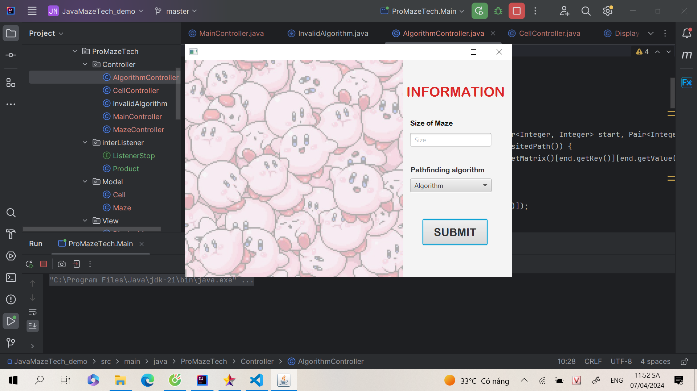

# ProMazeTech

ProMazeTech là một Ứng dụng demo thuật toán tìm đường. Nó sẽ áp dụng và so sánh hiệu quả của thuật toán BFS, DFS và hiển thị rõ ràng đường đi tìm được từ điểm khởi đầu đến điểm đích được chọn.

# UML Image

# Demo Image

